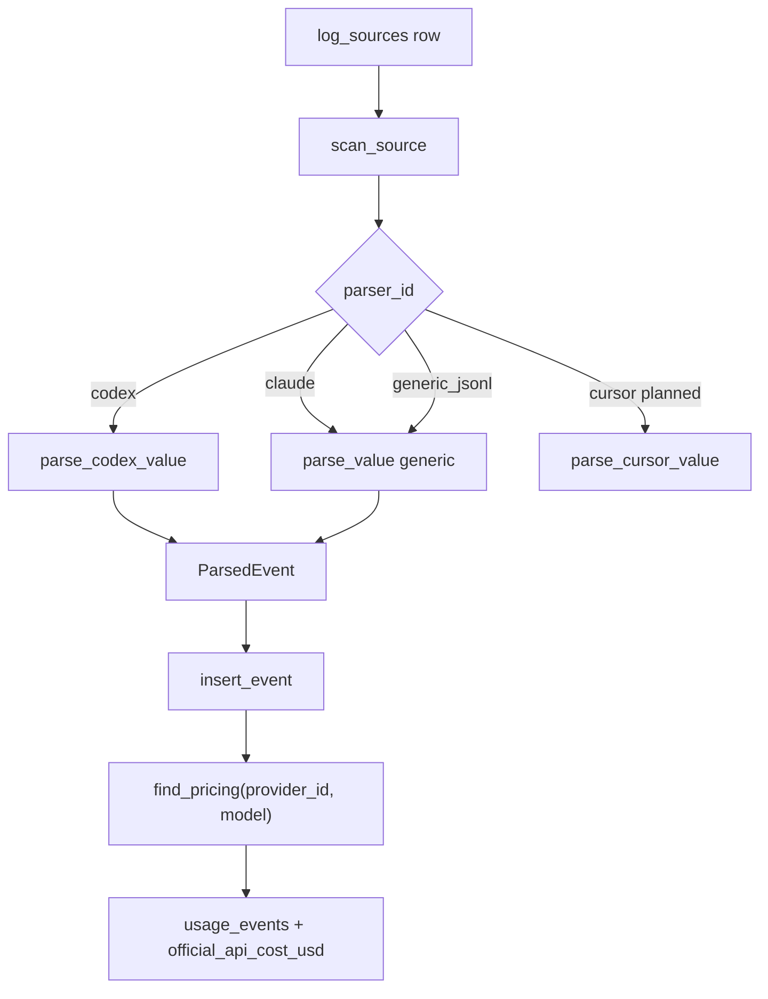
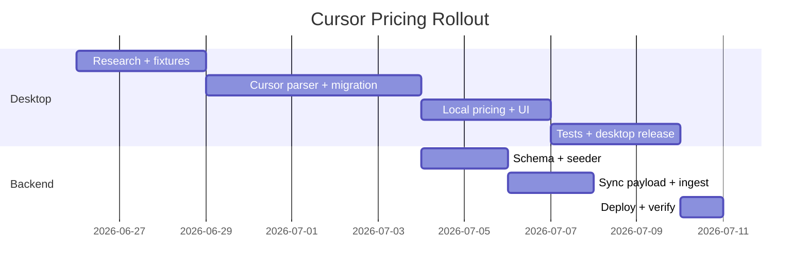

# Cursor Provider & Separate Pricing Plan

> **Goal:** Track Cursor as its own billing product while correctly pricing multi-vendor models (Claude, GPT, Gemini, etc.) at **Cursor rates**, not upstream API rates.
>
> **Execution order:** Desktop app first → Sync backend second.
>
> Track progress by checking boxes below. This file is Obsidian-friendly (frontmatter + task lists).

---

## Problem Statement

Cursor is an **aggregator/reseller**, not a single-model provider.

| What logs contain | What MEtR must do |
|---|---|
| Model string like `claude-sonnet-4-6`, `gpt-4o`, `cursor-small` | Price under **`provider_id = cursor`**, not `anthropic` / `openai` |
| Token usage in JSON/JSONL under `~/Library/Application Support/Cursor` | Parse reliably with a dedicated parser |
| Same model name used elsewhere (Claude Code, Codex CLI) | Keep pricing **scoped by billing context** so costs never cross-contaminate |

**Failure mode today:** Cursor uses `generic_jsonl` parser, events get `provider_id = cursor`, but there are **no `cursor`-scoped prices** in the catalog. Cost shows as *Unknown* — or if we naïvely matched upstream provider prices, numbers would be **wrong** (Cursor Pro ≠ Anthropic API).

---

## Research Findings (2026-06-26)

### Cursor folders on macOS

| Path | Contents |
|---|---|
| `~/Library/Application Support/Cursor/` | App data: `logs/`, `User/globalStorage/state.vscdb`, workspace storage, process-monitor |
| `~/.cursor/` | Agent transcripts (`projects/*/agent-transcripts/*.jsonl`), skills, extensions |

MEtR currently detects only `Application Support/Cursor`. **Also scan `~/.cursor`** for agent transcripts (model + conversation metadata, but see below).

### Local log examination — token source verdict (2026-06-26, deep pass)

#### Where Cursor *can* store per-event tokens (schema exists)

Third-party tooling ([tokenuse.app Cursor docs](https://tokenuse.app/docs/development/tools/cursor/)) and local DB inspection confirm the **intended** per-event source:

| Source | Table / path | Token fields | Notes |
|---|---|---|---|
| **V2 bubbles** | `state.vscdb` → `cursorDiskKV` key `bubbleId:{composerId}:{bubbleId}` | `tokenCount.inputTokens`, `tokenCount.outputTokens` | One row per user/assistant message; `modelInfo.modelName` when set |
| **Composer rollup** | `cursorDiskKV` key `composerData:{composerId}` | `usageData` (aggregate) | Empty on this install |
| **Agent KV** | `cursorDiskKV` key `agentKv:blob:*` | **None** — role/content only | tokenuse estimates `chars/4` |
| **Agent transcripts** | `~/.cursor/projects/*/agent-transcripts/*.jsonl` | **None** | Model + conversation only |
| **ai-code-tracking.db** | `ai_code_hashes`, `conversation_summaries` | **None** | `requestId`, `model`, `fileName`; summaries empty here |
| **App logs** | `logs/*/Cursor Structured Logs*.log` | **None** | Model names only |

App logs and JSONL transcripts do **not** contain `input_tokens` / `prompt_tokens`. Real usage is meant to live in bubble `tokenCount`, not in log files.

#### This install (Cursor 3.8–3.9, macOS)

| Metric | Value |
|---|---|
| `bubbleId:*` rows | **462** bubbles, **0** with `inputTokens + outputTokens > 0` |
| `composerData:*` with filled `usageData` | **0 / 10** |
| Binary scan of `state.vscdb` for non-zero `"inputTokens":N` | **0 matches** |
| Bubbles with `modelInfo.modelName` | **11 / 462** |
| Privacy mode | `privacyMode=true`, `newPrivacyMode2={"privacyMode":"PRIVACY_MODE_NO_STORAGE"}` |

**Verdict for this machine:** Cursor **does not persist usable per-event token counts** locally. The `tokenCount` field exists on every bubble but is always `{inputTokens:0, outputTokens:0}`. Likely cause: **Privacy Mode → No Storage**.

**Model slugs observed in Structured Logs** (for catalog aliases when tokens appear):

`default`, `composer-2.5`, `claude-opus-4-8`, `gpt-5.5`, `claude-sonnet-4-6`, `gpt-5.3-codex`, `claude-opus-4-7`, `gpt-5.4`, `claude-opus-4-6`, `claude-opus-4-5`, `gpt-5.2`, `gemini-3.1-pro`, `gpt-5.4-mini`, `claude-haiku-4-5`, `kimi-k2.5`, `gemini-2.5-flash`, …

#### MEtR support decision

| Scenario | Support? |
|---|---|
| Bubbles with non-zero `tokenCount` | **Yes** — dedicated `cursor` parser reading `state.vscdb` |
| All bubbles zero (this install) | **No accurate cost** — show *Usage unavailable* per product spec |
| Char-based estimation (`chars/4`, tokenuse-style) | Technically possible, but **conflicts with MEtR spec** (“do not guess usage”) unless policy changes |

**Recommendation:** Parser targets `bubbleId:*`; emit priced events only when `inputTokens + outputTokens > 0`; otherwise mark unavailable. **Re-test with Privacy Mode off** before shipping — tokenuse notes Cursor v3 sometimes still records zero tokens.

- [x] **D1.1** Collect real Cursor log samples (macOS) — done 2026-06-26
- [x] **D1.2** Document which files contain token usage — schema in bubbles; **all zero on this install**
- [x] **D1.2b** Investigate composer KV / privacy mode — **NO_STORAGE likely suppresses tokens**

### Cursor pricing vs MEtR catalog

Source: [cursor.com/docs/models-and-pricing](https://cursor.com/docs/models-and-pricing) (fetched 2026-06-26).

**Key policy:** Cursor bills API-pool models **at provider API rates** (no markup on individual plans). On-demand usage uses the same rates. Separate `provider_id = cursor` rows are still required for **billing context** (subscription tab, never cross-mix with Claude Code / Codex direct usage).

#### Overlapping models — price comparison ($/1M tokens)

| Model (Cursor slug) | MEtR provider | Input | Output | Cache read | Cache write | Match? |
|---|---|---:|---:|---:|---:|---|
| `claude-sonnet-4-6` | anthropic | $3 | $15 | $0.30 | MEtR **$6.00** / Cursor **$3.75** | Partial — cache write differs |
| `claude-haiku-4-5` | anthropic | $1 | $5 | $0.10 | MEtR **$2.00** / Cursor **$1.25** | Partial |
| `claude-opus-4-5` | anthropic | $5 | $25 | $0.50 | MEtR **$10.00** / Cursor **$6.25** | Partial |
| `claude-fable-5` | anthropic | $10 | $50 | $1.00 | $12.50 | **Exact** |
| `gpt-5.3-codex` | openai | $1.75 | $14 | $0.175 | — | **Exact** |
| `gpt-5.4` | openai | $2.50 | $15 | $0.25 | — | **Exact** |
| `gpt-5.4-mini` | openai | $0.75 | $4.50 | $0.075 | — | **Exact** |
| `gpt-5.5` | openai | $5.00 | $30 | $0.50 | — | **Exact** |
| `gpt-5.1` / codex | openai | $1.25 | $10 | $0.125 | — | **Exact** |
| `gpt-5.1-mini` / codex-mini | openai | $0.25 | $2 | $0.025 | — | **Exact** |
| `gemini-3.1-pro` | google (MEtR: `gemini-2.5-pro`) | Cursor $2 / MEtR $1.25 | $12 / $10 | $0.20 / $0.31 | — | Different model generation |
| `kimi-k2.5` | kimi (MEtR: `kimi-k2.6`) | Cursor $0.60 / MEtR $0.95 | $3 / $4 | $0.10 / $0.16 | — | Different model version |

#### Cursor-only models (need new `provider_id = cursor` rows)

| Model | Input | Cache read | Output | Notes |
|---|---:|---:|---:|---|
| `composer-2.5` | $0.50 | $0.20 | $2.50 | Cursor-native; Auto pool |
| `composer-2` | $0.50 | $0.20 | $2.50 | Same as 2.5 |
| `composer-1.5` | $3.50 | $0.35 | $17.50 | Hidden in UI |
| Auto pool | $1.25 | $0.25 | $6.00 | When `modelName=default` / Auto |

#### Pricing strategy decision

1. **Still use `provider_id = cursor`** for all Cursor-sourced events (user confirmed).
2. **Same model slug, separate catalog row** — e.g. `cursor:claude-sonnet-4-6` vs `anthropic:claude-sonnet-4-6`.
3. **For API-pool models:** seed Cursor rows from [Cursor docs](https://cursor.com/docs/models-and-pricing), not from upstream `ModelPriceSeeder` — Anthropic cache-write rates in MEtR use 1-hour tier ($6) while Cursor documents 1.25× input ($3.75).
4. **Do not auto-copy** upstream prices into `cursor` — even when equal, keep explicit rows for correct billing context.
5. **Composer / Auto / `default`:** must use Cursor-specific rates; cannot infer from upstream.

---

## Current Architecture (As-Is)

### Parser pipeline (desktop)



**Key files:**
- `src-tauri/src/lib.rs` — all parsing, DB, pricing, sync (~4.6k lines)
- `src/main.tsx` — UI (~2k lines)

**Registered parsers today:**

| parser_id | Used for | provider_id on event |
|---|---|---|
| `codex` | `~/.codex` | from log or source (`openai`) |
| `claude` | `~/.claude` | source (`anthropic`) |
| `gemini` | `~/.gemini` | source (`google`) |
| `continue` | `~/.continue` | source (`continue`) |
| `generic_jsonl` | Cursor, Cline, Kimi, Ollama, LM Studio | **always `source.provider_id`** |

**Critical rule in `parse_value`:**

```3540:3542:src-tauri/src/lib.rs
    Some(ParsedEvent {
        provider_id: source.provider_id.clone(),
        product_id: None,
```

Codex is the exception — it can detect provider from log fields. Generic parser **never** does upstream detection; billing context = log source.

### Database schema (desktop SQLite)

| Table | Purpose | Key columns |
|---|---|---|
| `providers` | Product/billing identity | `id`, `display_name` |
| `log_sources` | Watched folders | `provider_id`, `parser_id`, `path` |
| `usage_events` | Normalized token events | `provider_id`, `model`, `product_id` (unused), tokens, `official_api_cost_usd`, `pricing_catalog_id` |
| `pricing_catalogs` | Local price rows | **`(provider_id, model)`** unique via `id = "{provider}:{model}"` |
| `indexed_files` | Incremental scan cache | path + mtime + parser_version |
| `subscriptions` | User subscription costs | `provider_id`, `monthly_amount`, billing dates |

**Pricing lookup** (`find_pricing_sql`):

```3801:3803:src-tauri/src/lib.rs
            "SELECT id, input_per_1m, output_per_1m, cached_input_per_1m, cache_write_per_1m, cache_read_per_1m, reasoning_per_1m, tool_per_1m
             FROM pricing_catalogs WHERE provider_id = ?1 AND lower(model) = lower(?2) LIMIT 1",
```

Aliases supported via `aliases_json`. **No fallback to another provider.**

### Database schema (sync backend MySQL)

| Table | Desktop equivalent |
|---|---|
| `providers` | `providers` |
| `model_prices` | `pricing_catalogs` (+ `effective_from` / `effective_to`) |
| `usage_events` | synced copy of desktop events |
| `price_observations` | automated price crawl audit trail |

**Price resolution:** `ResolveModelPrice::handle($providerId, $model, $timestamp)` — same `(provider_id, model)` key.

### What already works in our favor

The existing `(provider_id, model)` composite key **already supports separate Cursor pricing**:

```
pricing_catalogs:
  provider_id=cursor, model=claude-sonnet-4-6  → Cursor rate
  provider_id=anthropic, model=claude-sonnet-4-6 → Anthropic API rate
```

Same model string, different billing context. **No schema change required for basic separation.**

### What's missing

- [ ] Dedicated `cursor` parser (not `generic_jsonl`)
- [ ] Cursor log format research + fixtures
- [ ] `cursor` pricing catalog entries (seeder + pull sync)
- [ ] Model name normalization / aliases for Cursor-specific strings
- [ ] Optional `upstream_provider_id` metadata for UI ("Claude Sonnet via Cursor")
- [ ] Re-scan / cost recalculation after catalog update

---

## Design Decision: Billing Context vs Upstream Model

### Recommended model (Option A — extend, don't rewrite)

Keep two orthogonal concepts:

| Concept | Field | Example | Used for |
|---|---|---|---|
| **Billing context** | `provider_id` | `cursor` | Pricing lookup, subscription matching, dashboard tabs |
| **Upstream vendor** (optional) | `upstream_provider_id` (new) | `anthropic` | Display, analytics, future cross-product reports |
| **Model identity** | `model` | `claude-sonnet-4-6` | Pricing key within billing context |
| **Product/plan** (optional) | `product_id` (exists, unused) | `cursor-pro` | Future: Cursor Pro vs Business tiers |

### Rules

1. **Never auto-fallback pricing** from `cursor` → `anthropic` / `openai`. Missing Cursor price = Unknown cost.
2. **Parser sets `provider_id = cursor`** for all events from Cursor log sources.
3. **Parser may infer `upstream_provider_id`** from model prefix/heuristics — display only, not pricing.
4. **Catalog entries for Cursor** use Cursor's published rates ([cursor.com/pricing](https://www.cursor.com/pricing)), not upstream API pages.
5. **Aliases** map Cursor log variants → canonical catalog model names.

### Naming conventions

| Layer | Pattern | Example |
|---|---|---|
| Provider ID | lowercase slug | `cursor` |
| Display (tab) | Brand | `Cursor` |
| Model (catalog) | exact log string or normalized slug | `claude-sonnet-4-6` |
| Model (UI session row) | `{upstream label} · {model}` if upstream known | `Anthropic · claude-sonnet-4-6` |
| Pricing row ID | `{provider_id}:{model_lower}` | `cursor:claude-sonnet-4-6` |
| Subscription product | user-facing plan name | `Cursor Pro` |

### Alternative considered (rejected for v1)

| Option | Why not |
|---|---|
| Composite model keys (`cursor/claude-sonnet-4-6`) | Breaks existing anthropic/openai catalogs and sync API |
| Single global model table + price profiles | Over-engineered; `(provider_id, model)` already works |
| Price by upstream provider for Cursor events | Gives wrong dollar amounts vs Cursor subscription |

---

## Phase 1 — Desktop App Plan

### 1.1 Research & fixtures

- [ ] **D1.1** Collect real Cursor log samples (macOS + Windows paths)
  - `~/Library/Application Support/Cursor/`
  - `%APPDATA%/Cursor/`
- [ ] **D1.2** Document which files contain token usage (composer logs, agent transcripts, state DB exports)
- [ ] **D1.3** Add `fixtures/cursor/sample.jsonl` with anonymized real structure
- [ ] **D1.4** Add `fixtures/cursor/malformed/` edge cases

### 1.2 Dedicated Cursor parser

- [ ] **D2.1** Add `parser_id = "cursor"` to candidate detection (`candidate_sources`)
- [ ] **D2.2** Implement `parse_cursor_value()` in `lib.rs`
  - Handle Cursor-specific JSON paths for usage, model, timestamp, session/project
  - Maintain `GenericParseContext` or Cursor-specific context for multi-line sessions
- [ ] **D2.3** Implement `normalize_cursor_model(raw: &str) -> String` for catalog matching
- [ ] **D2.4** Implement `infer_upstream_provider(model: &str) -> Option<&str>` heuristic
  - `claude-*` → `anthropic`, `gpt-*` / `o*` → `openai`, `gemini-*` → `google`, etc.
- [ ] **D2.5** Migration: add `upstream_provider_id TEXT` to `usage_events` (nullable)
- [ ] **D2.6** Populate `upstream_provider_id` in `insert_event`
- [ ] **D2.7** Bump `PARSER_VERSION` → force re-index of Cursor sources
- [ ] **D2.8** Migration path: existing Cursor sources on `generic_jsonl` → offer auto-upgrade to `cursor` parser on rescan

### 1.3 Cursor pricing catalog (local)

- [ ] **D3.1** Create `sync-server/backend/database/seeders/cursor/` or section in `ModelPriceSeeder` — **also seed desktop** via `pull_pricing` on login OR bundled seed file
- [ ] **D3.2** Define initial Cursor model price rows (`provider_id = cursor`):
  - Premium models used in Cursor (Claude Sonnet/Opus, GPT-4o, etc.) at **Cursor published rates**
  - Cursor-native models (`cursor-small`, `cursor-fast`, composer models) if logged
- [ ] **D3.3** Add aliases for Cursor-specific model strings observed in logs
- [ ] **D3.4** Document source URL + `catalog_version` for each row
- [ ] **D3.5** Verify `list_missing_models` surfaces unmapped Cursor models in Settings UI

### 1.4 UI updates

- [ ] **D4.1** Session table: show upstream badge when `upstream_provider_id` present
  - e.g. `Anthropic · claude-sonnet-4-6` under Cursor tab
- [ ] **D4.2** Missing models UI: pre-fill `provider_id = cursor` when adding price from Cursor tab
- [ ] **D4.3** Settings source list: show `cursor` parser label (not generic_jsonl)
- [ ] **D4.4** Provider label map in `main.tsx` — no change needed (`cursor` already exists)
- [ ] **D4.5** Optional: filter/group sessions by upstream provider within Cursor tab

### 1.5 Testing & validation

- [ ] **D5.1** Unit tests in `lib.rs` for `parse_cursor_value`, model normalization, upstream inference
- [ ] **D5.2** Manual test: add `fixtures/cursor/` as source → rescan → verify events + costs
- [ ] **D5.3** Regression: Claude Code (`anthropic`) and Codex (`openai`) costs unchanged
- [ ] **D5.4** Verify subscription comparison on Cursor tab uses `provider_id = cursor` subscription vs Cursor-scoped API costs

### 1.6 Desktop deployment

| Method | Trigger | What ships |
|---|---|---|
| **GitHub Release (primary)** | Tag push `v*.*.*` | macOS DMG + tar.gz, Windows MSI, Linux deb/AppImage |
| **Auto-updater** | Tauri updater plugin | Signed delta/full updates from sync server |
| **Local build** | `npm run tauri:build` or `scripts/build-release.sh` | Local installers |

**Release pipeline** (`.github/workflows/release.yml`):
1. Validate version sync (`package.json`, `Cargo.toml`, `tauri.conf.json`)
2. Parallel build: macOS / Windows / Linux
3. GitHub Release + SHA256SUMS
4. SCP artifacts to production server (Tailscale + SSH)
5. `php artisan metr:release:publish` registers update manifests

**Desktop release checklist for this feature:**
- [ ] **D6.1** Bump version in all three version files
- [ ] **D6.2** Include migration note: "Rescan Cursor source after update"
- [ ] **D6.3** Tag `vX.Y.Z` → CI builds and publishes
- [ ] **D6.4** Smoke test updater endpoint after publish

---

## Phase 2 — Sync Backend Plan

### 2.1 Provider & pricing data

- [ ] **B1.1** Confirm `cursor` in `ProviderSeeder` (already present)
- [ ] **B1.2** Add Cursor model prices to `ModelPriceSeeder` (`provider_id = cursor`)
- [ ] **B1.3** Add `CursorPricingSource` OR manual seed section sourced from [cursor.com/pricing](https://www.cursor.com/pricing)
  - LiteLLM won't have Cursor reseller rates — **do not** rely on `metr:prices:update --source=litellm` for Cursor
- [ ] **B1.4** Admin UI (`pricing.blade.php`): filter/group by provider, highlight Cursor rows
- [ ] **B1.5** Ensure `/api/v1/sync/settings` returns Cursor prices to desktop `pull_pricing`

### 2.2 Usage event ingestion

- [ ] **B2.1** Migration: add `upstream_provider_id` to backend `usage_events` (nullable)
- [ ] **B2.2** Update `IngestUsageEvents` to accept + store `upstream_provider_id` from sync payload
- [ ] **B2.3** Update desktop sync payload builder to include `upstream_provider_id`
- [ ] **B2.4** `ResolveModelPrice` — no change needed (already uses event's `provider_id`)
- [ ] **B2.5** Dashboard reports: optional "by upstream model" breakdown for Cursor events

### 2.3 Backend deployment

| Method | Trigger | What ships |
|---|---|---|
| **GitHub Actions (primary)** | Push to `main` changing `sync-server/backend/**` | rsync PHP code to server |
| **Docker Compose (server)** | Manual on server | `docker compose up`, migrations via `docker exec metr-sync-php php artisan migrate` |
| **Local dev** | `docker compose up -d` in `sync-server/` | Full stack |

**Deploy pipeline** (`.github/workflows/deploy-backend.yml`):
1. Tailscale connect
2. `rsync` backend → `/opt/metr-sync/site/backend/` (excludes `.env`, `vendor/`, `storage/`)
3. `docker exec metr-sync-php php artisan optimize`
4. Health check via `php artisan about`

**Backend release checklist for this feature:**
- [ ] **B3.1** Add migration for `upstream_provider_id`
- [ ] **B3.2** Update seeders with Cursor prices
- [ ] **B3.3** Merge to `main` → auto-deploy
- [ ] **B3.4** SSH: `docker exec metr-sync-php php artisan migrate --force`
- [ ] **B3.5** SSH: `docker exec metr-sync-php php artisan db:seed --class=ModelPriceSeeder --force` (or targeted seeder)
- [ ] **B3.6** Verify `/api/v1/sync/settings` includes cursor prices
- [ ] **B3.7** Desktop: Pull Pricing → rescan → verify costs

**Note:** Backend deploy does **not** restart desktop apps. Users get new prices via **Pull Pricing** or on next login sync. Parser changes require **desktop app update**.

---

## How to Add Any New Provider/Model (Reference)

### Add a new provider (e.g. `windsurf`)

**Desktop:**
1. Add to `seed_defaults()` provider list
2. Add to `provider_display_name()` match arms
3. Add to `candidate_sources()` with path + parser
4. Add to `providerLabel()` in `main.tsx`
5. Implement parser OR assign existing parser
6. Bump `PARSER_VERSION` if parser logic changed

**Backend:**
1. Add row to `ProviderSeeder`
2. Run seeder / migration

### Add a new model price

**Desktop (manual):**
- Settings → Missing Models → Add price
- Or `add_pricing` Tauri command → inserts `pricing_catalogs` row

**Backend (catalog):**
- Add to `ModelPriceSeeder` with `provider_id`, `model`, rates, `aliases`
- Or admin pricing UI / API `POST /api/v1/pricing`

**Sync flow:**
- Server → Desktop: login / Pull Pricing → `pull_pricing_from_server`
- Desktop → Server: Push Pricing (user overrides)

### Parser selection guide

| Situation | parser_id |
|---|---|
| Known format, stable schema | Dedicated (`codex`, `claude`, `cursor`) |
| Multiple products share JSONL shape | `generic_jsonl` + distinct `provider_id` per source |
| User custom folder | User picks provider + parser in Settings |

---

## Execution Timeline (Suggested)



---

## Open Questions (Resolve Before Implementation)

- [x] **Q1:** Model strings in logs — see Research Findings (`claude-sonnet-4-6`, `gpt-5.3-codex`, `composer-2.5`, `default`, …)
- [x] **Q2:** Cursor publishes **per-model token rates** at API pricing for API pool; Composer/Auto have separate pool rates
- [ ] **Q3:** Should `product_id` distinguish Cursor Pro vs Business for different rate cards?
- [ ] **Q4:** Do we migrate existing `generic_jsonl` Cursor events on parser upgrade, or require full rescan?
- [ ] **Q5:** Windows Cursor path — confirm `%APPDATA%\Cursor` vs `%LOCALAPPDATA%`
- [x] **Q6:** Token counts live in `state.vscdb` → `cursorDiskKV` → `bubbleId:*` → `tokenCount` — but **all zero on this install** (privacy NO_STORAGE). No other local per-event source found.

---

## Related Docs

- [[product_specs]] — original provider/parser spec (§9)
- [[desktop_audit_2026-06-14]] — release/security notes
- `sync-server/backend/database/seeders/ModelPriceSeeder.php` — canonical price seed
- `src-tauri/src/lib.rs` — parser + pricing implementation

---

## Quick Status Board

| Area | Status | Blocker |
|---|---|---|
| Cursor log format research | 🟢 Done | Tokens in bubble schema; zero on this install (privacy mode) |
| Desktop parser | ⬜ Not started | Research |
| Desktop pricing catalog | ⬜ Not started | Cursor rate source |
| Desktop UI | ⬜ Not started | Parser |
| Backend schema | ⬜ Not started | Desktop schema decision |
| Backend pricing seed | ⬜ Not started | Rate research |
| Backend sync | ⬜ Not started | Desktop payload |
| Desktop release | ⬜ Not started | All desktop tasks |
| Backend deploy | ⬜ Not started | All backend tasks |
